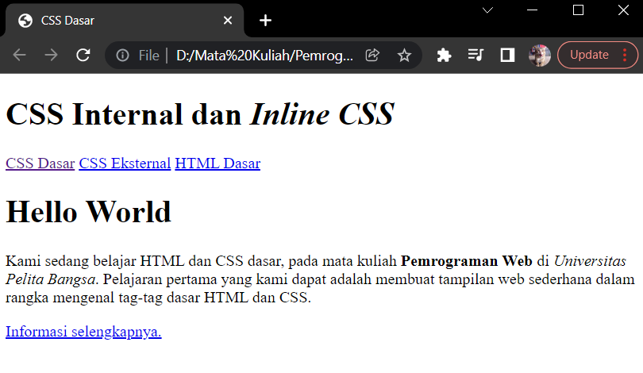
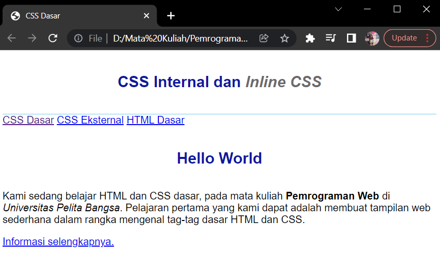
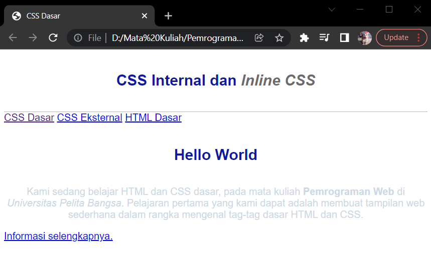
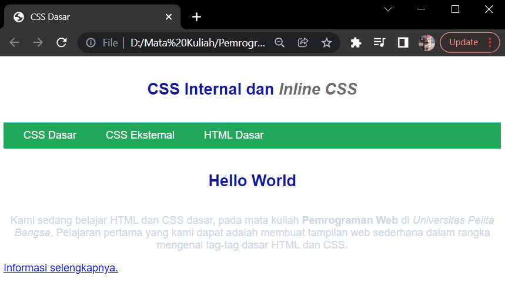
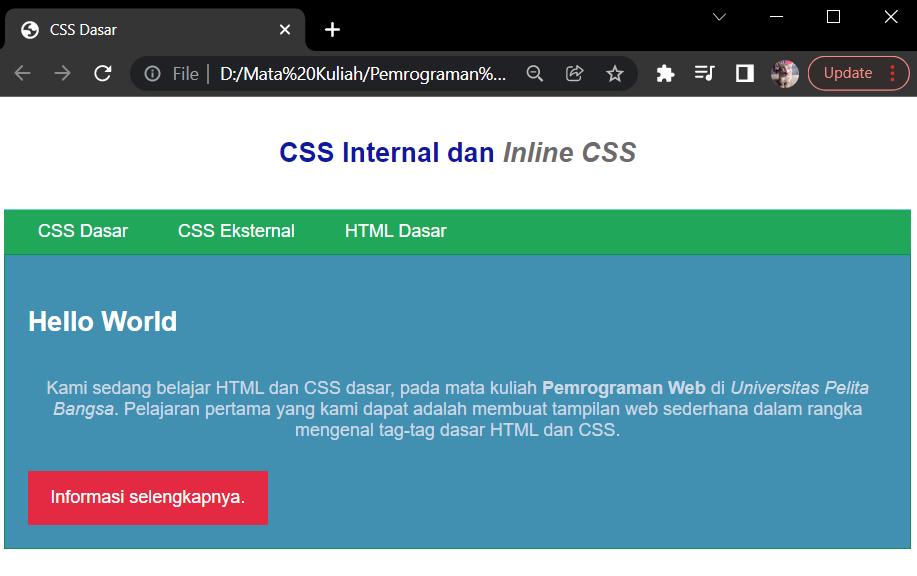

# Latihan menggunakan CSS pada website 

* Nama          : Hizbullah Ridwan
* NIM           : 312110055
* Kelas         : TI.21.B.1
* Mata Kuliah   : Pemrograman Web

Dalam latihan menggunakan CSS ini, saya menggunakan [Google Chrome](https://www.google.com/intl/id_id/chrome/) sebagai web browser dan [visual studio code](https://code.visualstudio.com/) sebagai teks editornya.       

## Membuat Dokumen HTML

Hal pertama yang harus disiapkan adalah membuat file HTML dasar. Pada file HTML ini juga         
sudah disiapkan beberapa elemen seperti header, paragraf, dan juga hyperlink.            

```bash
<!DOCTYPE html>
<html lang="en">
    <head>
        <meta charset="UTF-8">
        <meta name="viewport" content="width=device-width, initial-scale=1.0">
        <title>CSS Dasar</title>
    </head>
    <body>
        <header>
            <h1>CSS Internal dan <i>Inline CSS</i></h1>
        </header>
        <nav>
            <a href="lab2_css_dasar.html">CSS Dasar</a>
            <a href="lab2_css_eksternal.html">CSS Eksternal</a>
            <a href="lab1_tag_dasar.html">HTML Dasar</a>
        </nav>
        <!-- CSS ID Selector -->
        <div id="intro">
            <h1>Hello World</h1>
            <p>Kami sedang belajar HTML dan CSS dasar, pada mata kuliah <b>Pemrograman Web</b> di 
            <i>Universitas Pelita Bangsa</i>. Pelajaran pertama yang kami dapat adalah membuat 
            tampilan web sederhana dalam rangka mengenal tag-tag dasar HTML dan CSS.</p>
            <!-- CSS Class Selector -->
            <a class="button btn-primary" href="#intro">Informasi selengkapnya.</a>
        </div>
    </body>
</html>
```         

Setelah selesai dibuat dan disimpan, jalankan file HTML pada web browser dan lihat hasilnya.            

      

## Mendeklarasikan CSS Internal

Setelah membuat file HTML, selanjutnya adalah mendeklarasikan CSS secara internal        
pada bagian `<head>` file HTML. Untuk menambahkan internal CSS maka perlu menggunakan tag `<style>`         
barulah didalam tag `<style>` bisa menggunakan syntax CSS.           

```bash
<head>
    <style>
        body {
            font-family:'Open Sans', sans-serif;
        }
        header {
            min-height: 80px;
            border-bottom:1px solid #77CCEF;
        }
        h1 {
            font-size: 24px;
            color: #0F189F;
            text-align: center;
            padding: 20px 10px;
        }
        h1 i {
            color:#6d6a6b;
        }
    </style>
</head>
```         

Refresh web browser dan lihat hasilnya. Dibawah elemen header terdapat border berwarna biru          
dengan tebal 1px dan bergaris solid. Kemudian pada `<h1>` font size nya sudah diubah menjadi 24px    
dengan warna biru juga. Ditambah juga dengan jarak padding dan `<h1>` italic diubah warnanya menjadi      
abu abu.              

       

## Menambahkan Inline CSS

Inline CSS adalah menambahkan CSS langsung pada setiap elemen di file HTML. Caranya adalah menambahkan        
atribut `style` pada elemen HTML dan syntax CSS bisa ditambahkan didalamnya.           

```bash
<p style="text-align: center; color: #ccd8e4;">
```         

Refresh web browser dan lihat hasilnya. Warna dari elemen paragraf sudah berubah dan teks menjadi       
rata tengah.                  

       

## Membuat CSS Eksternal

untuk membuat CSS eksternal caranya adalah membuat file `.css` yang baru dan terpisah dari file     
HTML yang sudah dibuat. File CSS yang akan dibuat diberi penamaan bebas, disini nama filenya       
adalah `style_eksternal.css`. Setelah file CSS dibuat, deklarasikan CSS seperti ini :          

```bash
nav {
    background: #20A759;
    color:#fff;
    padding: 10px;
}
nav a {
    color: #fff;
    text-decoration: none;
    padding:10px 20px;
}
nav .active,
nav a:hover {
    background: #0B6B3A;
}
```         

Setelah itu, perlu tambahkan tag `<link>` didalam tag `<head>` file HTML yang sudah ada.         
Nama file pada atribut href disesuaikan dengan nama file CSS yang sudah dibuat.           

```bash
<head>
    <!-- menyisipkan css eksternal -->
    <link rel="stylesheet" href="style_eksternal.css" type="text/css">
</head>
```         

Simpan file CSS kemudian refresh browser dan lihat hasilnya. Terlihat elemen Nav sudah berubah warna      
menjadi hijau dan tidak ada lagi underline pada teks hyperlink karena text-decoration sudah      
diubah ke none. Warna pada saat hover mouse kearah hyperlink pun bisa berubah karena sudah deklarasi      
hover background.                

       

## Menambahkan CSS Selector

Untuk menambahkan CSS Selector, caranya adalah menambahkan id atau class selectornya       
terlebih dahulu pada elemen HTML yang akan dipilih. Sebelumnya sudah ditambahkan id dan class yang         
diberi nama `#intro`, `.button`, dan `.btn-primary`. Seperti ini :         

```bash
<div id="intro"></div>
<a class="button btn-primary"></a>
```         

Pada file HTML, selector id hanya bisa ditambahkan 1 kali saja, berbeda dengan selector class       
yang bisa ditambahkan berkali-kali. selector id ditandai dengan simbol `#` didepan nama selectornya.        
Sedangkan selector class ditandai dengan simbol `.` didepan nama selectornya.      

Selanjutnya adalah menambahkan code CSS nya. Bisa ditambahkan ke internal, inline, maupun eksternal.       
Namun kali ini CSS selector akan ditambahkan kedalam eksternal CSS yaitu pada file `style_eksternal.css`.          

```bash
/* ID Selector */
#intro {
    background: #418fb1;
    border: 1px solid #099249;
    min-height: 100px;
    padding: 10px;
}
#intro h1 {
    text-align: left;
    border: 0;
    color: #fff;
}

/* Class Selector */
.button {
    padding: 15px 20px;
    background: #bebcbd;
    color: #fff;
    display: inline-block;
    margin: 10px;
    text-decoration: none;
}
.btn-primary {
    background: #E42A42;
}
```         

Save kemudian refresh web browser dan lihat hasilnya.          

       

## Pertanyaan dan Tugas

1. Lakukan eksperimen dengan mengubah dan menambah properti dan nilai pada kode CSS dengan mengacu       
pada CSS Cheat Sheet yang diberikan pada file terpisah dari modul ini.          

2. Apa perbedaan pendeklarasian CSS elemen `h1 {...}` dengan `#intro h1 {...}` ? berikan penjelasannya!         

3. Apabila ada deklarasi CSS secara internal, lalu ditambahkan CSS eksternal dan inline CSS         
pada elemen yang sama. Deklarasi manakah yang akan ditampilkan pada browser?           
Berikan penjelasan dan contohnya!          

4. Pada sebuah elemen HTML terdapat ID dan Class, apabila masing-masing selector tersebut terdapat        
deklarasi CSS, maka deklarasi manakah yang akan ditampilkan pada browser? Berikan penjelasan          
dan contohnya! `<p id="paragraf-1" class="text-paragraf">`         
